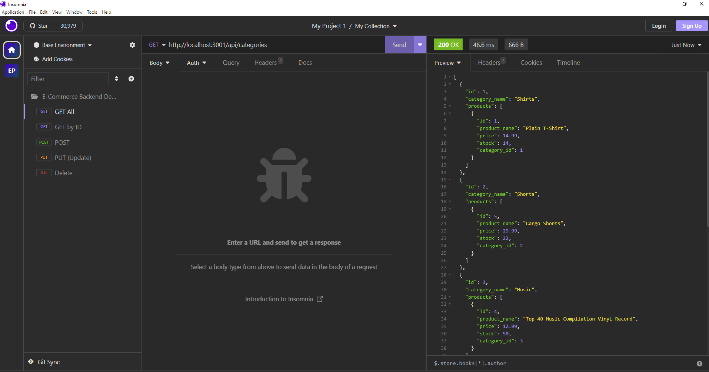

# E-Commerce-Backend

## Technologies


## Description

The challenge is to build the back end for an e-commerce site. Configure a working Express.js API to use Sequelize to interact with a MySQL database.

A walkthrough video that demonstrates its functionality and all of the following acceptance criteria being met is available on links below. Type the command below to run the program.

```
node server.js
```

## Installation

**_Requirments_**

[Node.js](https://nodejs.org/en/) | [Insomia](https://insomnia.rest/download) | [MySQL](https://www.npmjs.com/package/mysql2)

**_Once Installed:_**

1. Clone the Repository on to your machine.
2. Open the terminal and ensure you are in the right file path.
3. Run the command `npm install` to download the packages.
4. Then run the command `node server.js` to run the software.
5. Open Insomia to connect to the MySQL database thru the backend.

## User Story

```
AS A manager at an internet retail company
I WANT a back end for my e-commerce website that uses the latest technologies
SO THAT my company can compete with other e-commerce companies
```

## Acceptance Criteria

```
GIVEN a functional Express.js API
WHEN I add my database name, MySQL username, and MySQL password to an environment variable file
THEN I am able to connect to a database using Sequelize
WHEN I enter schema and seed commands
THEN a development database is created and is seeded with test data
WHEN I enter the command to invoke the application
THEN my server is started and the Sequelize models are synced to the MySQL database
WHEN I open API GET routes in Insomnia Core for categories, products, or tags
THEN the data for each of these routes is displayed in a formatted JSON
WHEN I test API POST, PUT, and DELETE routes in Insomnia Core
THEN I am able to successfully create, update, and delete data in my database
```

## Screenshot



## Video

A link to the [Video](https://drive.google.com/file/d/1MnxTEpfjKBl_fYjkzBEdrf7i9exX2AQb/view):

```
https://drive.google.com/file/d/1MnxTEpfjKBl_fYjkzBEdrf7i9exX2AQb/view

```

## Link

A link to the [code](https://github.com/epalermobootcamp/E-Commerce-Backend):

```
https://github.com/epalermobootcamp/E-Commerce-Backend
```

## Questions

If you have any questions about the repo, open an issue or contact me directly at [enrico.palermo@ymail.com](mailto:enrico.palermo@ymail.com).


Check out my other projects at [epalermobootcamp](https://github.com/epalermobootcamp)
